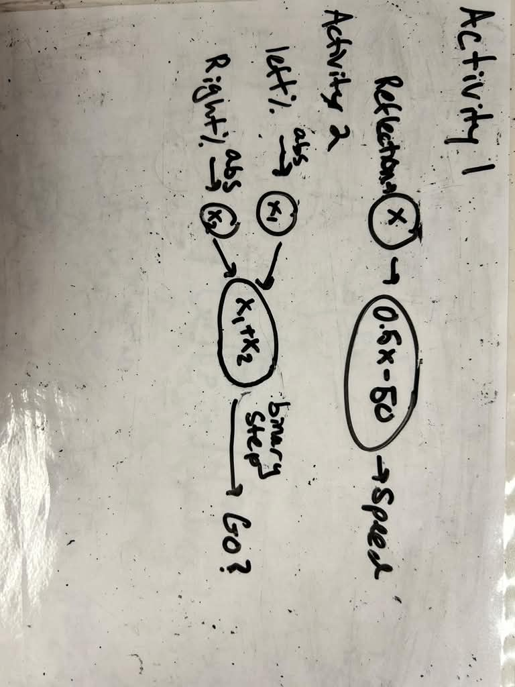

# OR Controlled Car

## Goal

Build your car now to be controlled by the joystick using an OR gate:
- Either or both joysticks being in the non-zero position moves the car forwards at a default speed
- Both joysticks being at zero means the car does not move

**Challenge:** Try drawing your diagram just like you did for the last activity before writing the program. What are the input(s) and output(s)? What is an equation that gets you from inputs to outputs? You might need to use something called an activation function, so look at the tips for help. 

Then, you can use your diagram to write your code as an equation rather than using the built in logical operators.

## Tips
<details>
<summary>Read tips</summary>

- Draw your diagram, the hard part is figuring out the equation. What is your output, and how can you represent it as a number?
- If you have multiple inputs, how do you make sure to include both of them in a linear equation? 
- You might find that you cannot get the output numbers exactly where you want them to be for a binary output, try using an **activation function** around your linear equation, something that alters the output of your linear equation in a non-linear way. Some examples of activation functions:
    - ReLU: any number below 0 becomes 0, other numbers stay their value
    - Binary Step: Anything over 0 becomes 1, anything less than or equal to 0 becomes 0
    - Absolute value: Take the magnitude of the number
- Feel free to use any combination of the above functions anywhere in your diagram you see fit, or make your own.

</details>

<details>
<summary>Example Code Solution</summary>

```python
c = le.Controller()
m = le.DoubleMotor()

c.connect()
m.connect()

def abs(x):
    if x < 0:
        return -1 * x
    else:
        return x

def binary_step(x):
    if x <= 0:
        return 0
    else:
        return 1

def layer(x1, x2):
    return (abs(x1) + abs(x2))

def predict(x1, x2):
    x1 = abs(x1)
    x2 = abs(x2)
    return (binary_step(layer(x1, x2)))

while True:
    go = predict(c.sensor.leftPercent, c.sensor.rightPercent)
    if go == 1:
        print("going")
        m.motor_run(direction=le.MOTOR_MOVE_DIRECTION_CLOCKWISE, speed=10, motor = le.MOTOR_LEFT)
        m.motor_run(direction=le.MOTOR_MOVE_DIRECTION_COUNTERCLOCKWISE, speed=10, motor = le.MOTOR_RIGHT)
    else:
        print("stopping")
        m.motor_stop(motor=le.MOTOR_BOTH)
    time.sleep(0.5)
```

</details>

## Modeling the Equation
<details>
<summary>Read instructions</summary>

Look at the tips for some help drawing your diagram if you haven't already.

Think about why the activation function was useful, and why neural networks might need these in addition to the linear layers.

<details>
<summary>Example Diagram Solution</summary>


</details>

</details>